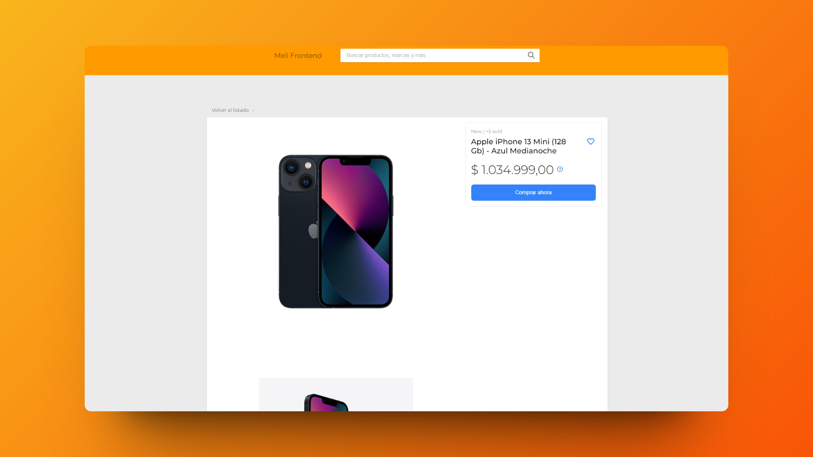

  
# 🔺 Next.js: Challenge of Mercado Libre

### 🛍 Prueba técnica de mercado libre hecha con Next.js

> 🧩 Aquí puedes ver su [**Live Demo.**](https://meli-prueba-abraham.vercel.app/)

## 🚀 Descripción

Este proyecto permite buscar productos de Mercado Libre y ver sus descripciones más detalladamente.

Con el objetivo de practicar por primera vez con el framework de React Next.js.

## 🎭 Tecnologías

El proyecto utiliza las siguientes tecnologías:

- La [**API**](https://developers.mercadolibre.com.ar/es_ar/items-y-busquedas) de **Mercado Libre** para realizar las búsquedas.
- **TypeScript** para validar los resultados de la API.
- [**Rutas dinámicas**](https://nextjs.org/docs/app/building-your-application/routing/dynamic-routes) para mostrar los productos más detallados.
